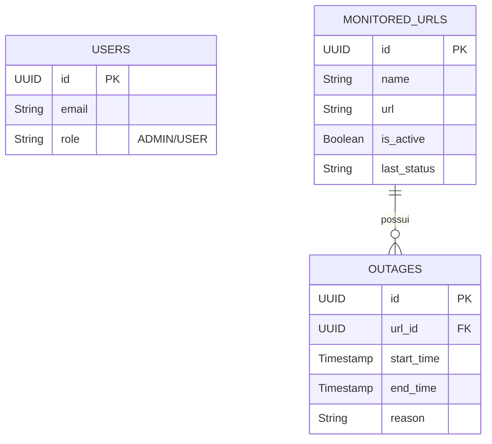

# Health Check System

Sistema interno para monitoramento automatizado de **disponibilidade de URLs**. O projeto verifica periodicamente se sites cadastrados estão operacionais e registra o histórico de quedas (*downtime*).

> **Nota:** Este é um sistema utilitário para gestão de infraestrutura, focado em **monitoramento passivo**.

---

## 📋 Regras de Negócio e Funcionamento

### 1. Permissões e Acesso

O sistema implementa controle de acesso restrito baseado em **roles**:

- **ADMIN**  
  Usuário com privilégios elevados. É o único capaz de:
  - Cadastrar novas URLs para monitoramento
  - Remover URLs existentes
  - Gerenciar o cadastro de usuários

- **USER**  
  Usuário padrão com acesso **somente leitura**:
  - Pode visualizar o status dos serviços
  - Não pode alterar configurações de monitoramento

---

### 2. Ciclo de Monitoramento (Scheduler)

O sistema opera em ciclos automáticos de verificação:

- **Intervalo:** 60 segundos (1 minuto)
- **Execução:**
  - O sistema busca todas as URLs ativas
  - Executa requisições HTTP de forma simultânea (processamento paralelo)
- **Delay:**
  - Fixo no agendador
  - Evita sobrecarga do servidor e loops descontrolados

---

### 3. Gestão de Incidentes (Outages)

O sistema evita a criação de logs repetitivos ("spam" de verificações bem-sucedidas). A persistência de dados é baseada **exclusivamente em mudanças de estado**:

- **Status UP (Online)**
  - Atualiza apenas o campo `last_checked_at`
  - Nenhum registro novo é criado

- **Status DOWN (Offline)**
  - Cria um novo registro na tabela `outages`
  - Marca o início do incidente (`start_time`)

- **Recuperação (Back Online)**
  - Localiza o incidente aberto
  - Preenche o horário de fim (`end_time`)
  - Encerra o registro da queda

---

## 🗄️ Estrutura do Banco de Dados

O sistema utiliza **PostgreSQL** com versionamento de schema via **Flyway**.

A tabela `outages` possui uma **chave estrangeira** ligada à tabela `monitored_urls`. Caso uma URL seja removida por um usuário **ADMIN**, todo o histórico de quedas associado é removido automaticamente (**Cascade**).

### Diagrama Entidade-Relacionamento



---

## 🚀 Guia de Configuração (Local)

### 1. Banco de Dados (Docker)

O projeto possui um arquivo `docker-compose.yml` na raiz. Para subir a infraestrutura local:

```bash
docker-compose up -d
```

---

### 2. Variáveis de Ambiente (IntelliJ IDEA)

Este projeto **não utiliza arquivo `.env` físico**, evitando exposição de credenciais. As variáveis devem ser configuradas diretamente na IDE.

#### Passo a passo:

1. No IntelliJ, acesse **Edit Configurations...**
2. Selecione a aplicação `HealthCheckApplication`
3. No campo **Environment Variables**, configure:

| Variável | Descrição | Exemplo (Dev) |
|--------|----------|---------------|
| DATABASE_URL | URL JDBC | jdbc:postgresql://localhost:5432/health_check_db |
| DATABASE_USERNAME | Usuário do banco | <SEU_USUARIO_LOCAL> |
| DATABASE_PASSWORD | Senha do banco | <SUA_SENHA_LOCAL> |
| DATABASE_LOCATION | Caminho das migrations | classpath:db/migration |

---

### 3. Configuração Inicial (Bootstrap)

O banco de dados inicia **vazio**. Para que o **Scheduler** funcione, é obrigatório criar manualmente um usuário **ADMIN**.

Execute no banco:

```sql
-- 1. Inserir usuário Admin
INSERT INTO users (email, role, check_interval)
VALUES ('admin@system.com', 'ADMIN', 1);

-- 2. Recuperar o ID gerado
SELECT id FROM users WHERE email = 'admin@system.com';
```

⚠️ **Configuração de Código:**  
Copie o UUID retornado no passo 2 e atualize a constante `SYSTEM_USER_ID` na classe:

```
UrlCheckScheduler.java
```

---

## 📡 Endpoints Principais

### Cadastrar URL (ADMIN)

- **Método:** `POST`
- **Endpoint:** `/urls`

```json
{
  "name": "Nome do Sistema",
  "url": "https://sistema.exemplo.com"
}
```

---

### Consultar Status

- **Método:** `GET`
- **Endpoint:** `/urls`

Retorna a lista de sites monitorados com:
- Status atual (`UP` / `DOWN`)
- Data da última verificação

---

## 🛠️ Tecnologias

- Java 21
- Spring Boot 3
- PostgreSQL
- Docker
- Flyway

