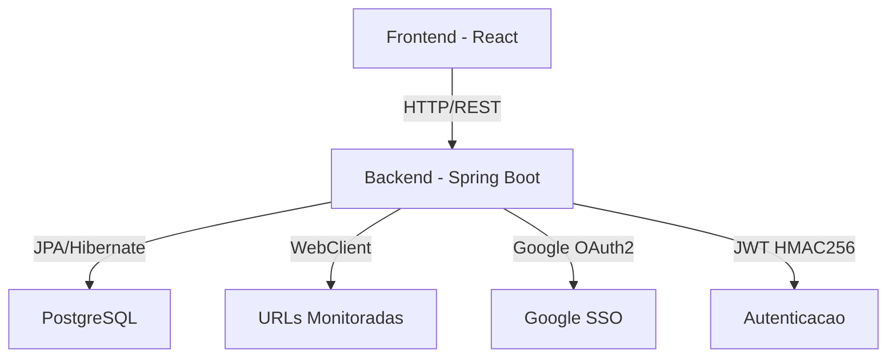
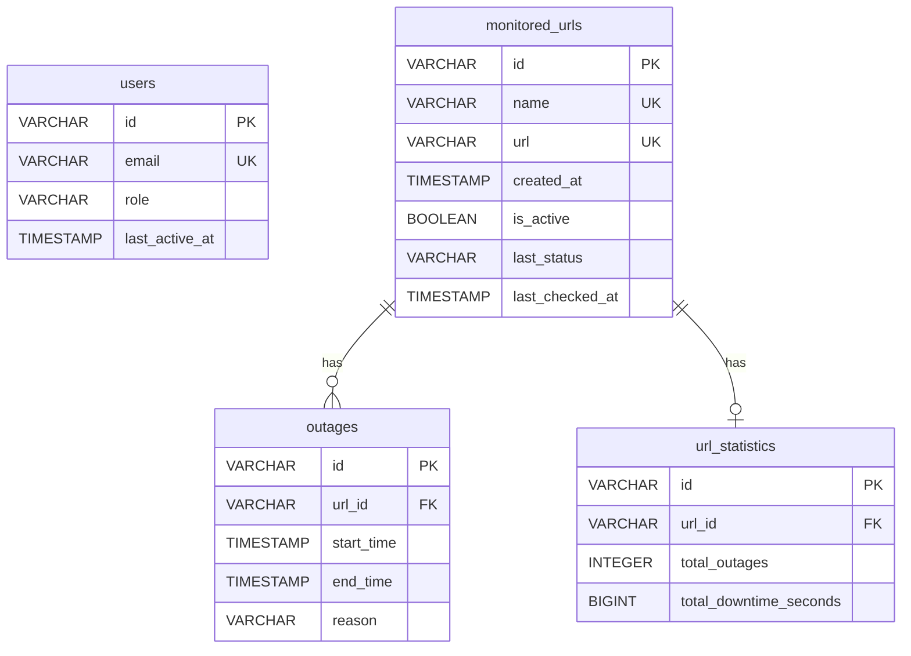
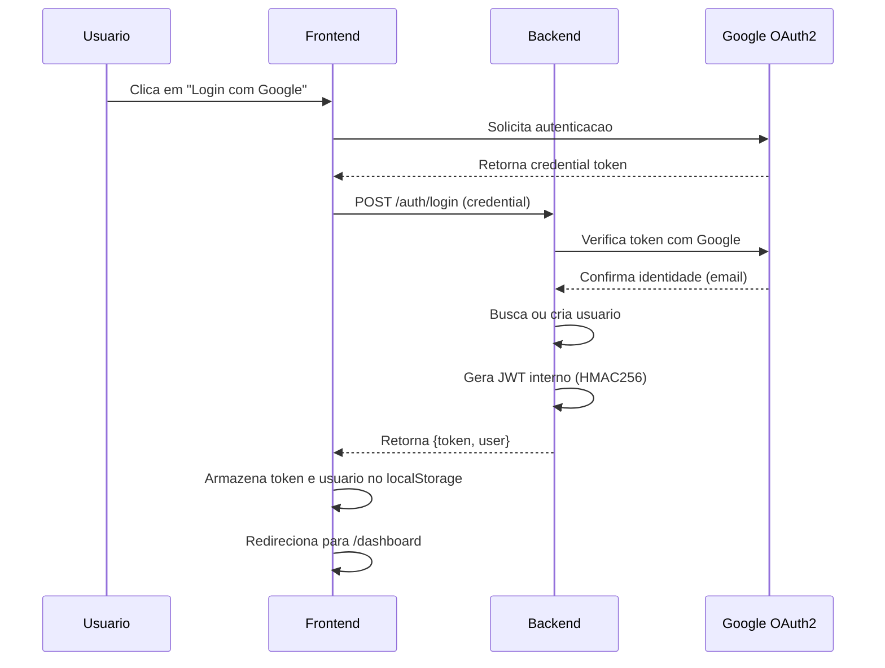
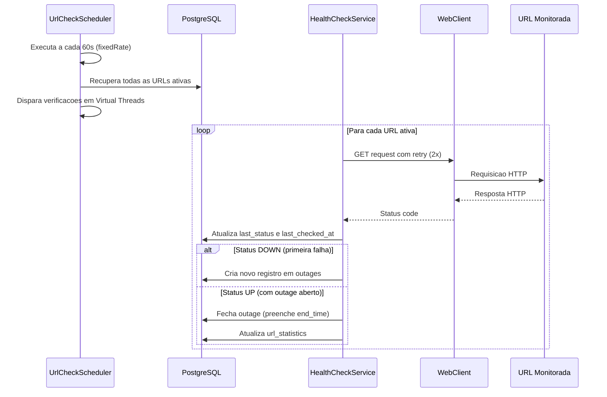

# HealthCheck

[](https://www.oracle.com/java/)
[](https://spring.io/projects/spring-boot)
[](https://react.dev/)
[](https://www.postgresql.org/)
[](https://www.docker.com/)

---

## Sobre o Projeto

O **HealthCheck** e uma aplicacao full-stack para **monitoramento automatizado de disponibilidade de URLs**. O sistema realiza verificacoes periodicas em URLs cadastradas, identifica quedas (downtime), registra incidentes de forma inteligente e mantem um historico consolidado de indisponibilidade.

A aplicacao e composta por uma **API RESTful** em Spring Boot (backend) e um **dashboard web** em React com TypeScript (frontend), ambos containerizados com Docker.

---

## Arquitetura

A aplicacao segue o **padrao de arquitetura em camadas** no backend e **arquitetura baseada em componentes** no frontend.

### Backend

| Camada | Responsabilidade |
|---|---|
| **Controller** | Exposicao das rotas REST e validacao de entrada |
| **Service** | Regras de negocio e orquestracao |
| **Repository** | Persistencia de dados via Spring Data JPA |
| **Entity** | Modelagem do dominio com JPA/Hibernate |
| **DTO** | Transferencia de dados (request/response) |
| **Mapper** | Conversao entre Entidades e DTOs |
| **Config** | Configuracao de seguranca, CORS e beans |
| **Scheduler** | Verificacao periodica de URLs |
| **Exception** | Tratamento centralizado de erros |

### Frontend

| Camada | Responsabilidade |
|---|---|
| **Pages** | Telas da aplicacao (Login, Dashboard) |
| **Components** | Componentes reutilizaveis de UI |
| **Context** | Gerenciamento de estado de autenticacao |
| **Hooks** | Logica de negocio reutilizavel |
| **Config** | Tema e branding da aplicacao |
| **Types** | Definicoes de tipos TypeScript |

### Diagrama de Arquitetura


```mermaid
graph TD
    A[Frontend - React] -->|HTTP/REST| B[Backend - Spring Boot]
    B -->|JPA/Hibernate| C[PostgreSQL]
    B -->|WebClient| D[URLs Monitoradas]
    B -->|Google OAuth2| E[Google SSO]
    B -->|JWT HMAC256| F[Autenticacao]
```

### Arvore de Diretorios

```text
healthcheck/
├── backend/
│   ├── Dockerfile
│   ├── docs/
│   └── src/
│       ├── main/
│       │   ├── java/com/example/health_check/
│       │   │   ├── config/
│       │   │   ├── controller/
│       │   │   ├── dto/
│       │   │   ├── exception/
│       │   │   ├── mapper/
│       │   │   ├── model/
│       │   │   │   ├── entity/
│       │   │   │   └── enums/
│       │   │   ├── repository/
│       │   │   ├── scheduler/
│       │   │   └── service/
│       │   └── resources/
│       │       ├── application.properties
│       │       └── db/migration/
│       └── test/
├── frontend/
│   ├── Dockerfile
│   ├── nginx.conf
│   ├── src/
│   │   ├── components/
│   │   │   ├── auth/
│   │   │   ├── layout/
│   │   │   ├── modals/
│   │   │   └── ui/
│   │   ├── config/
│   │   ├── context/
│   │   ├── hooks/
│   │   ├── pages/
│   │   └── types/
│   ├── package.json
│   ├── vite.config.ts
│   └── tailwind.config.cjs
├── docker-compose.yml
├── pom.xml
└── mvnw
```

---

## Tecnologias Utilizadas

### Backend

| Tecnologia | Versao | Uso |
|---|---|---|
| Java | 21 | Linguagem principal |
| Spring Boot | 3.4.4 | Framework principal |
| Spring Data JPA | - | Persistencia e repositorios |
| Spring Security | - | Autenticacao e autorizacao |
| Spring WebFlux | - | WebClient reativo para verificacao de URLs |
| Spring Validation | - | Validacao de DTOs |
| Hibernate | - | ORM e dialeto PostgreSQL |
| Flyway | - | Versionamento de schema do banco |
| Auth0 Java-JWT | 4.5.0 | Geracao e validacao de tokens JWT |
| Google API Client | 2.8.1 | Verificacao de tokens Google |
| Google Auth Library | 1.19.0 | Autenticacao OAuth2 com Google |
| Lombok | - | Reducao de boilerplate |
| PostgreSQL Driver | - | Conector JDBC |

### Frontend

| Tecnologia | Versao | Uso |
|---|---|---|
| React | 19 | Biblioteca UI |
| TypeScript | 5.9 | Tipagem estatica |
| Vite | 7.3 | Build tool e dev server |
| TailwindCSS | 3.4 | Framework CSS |
| React Router DOM | 7.13 | Roteamento SPA |
| TanStack React Query | 5.90 | Gerenciamento de estado server-side |
| TanStack React Table | 8.21 | Tabelas de dados |
| Axios | 1.13 | Cliente HTTP |
| React Hook Form | 7.71 | Gerenciamento de formularios |
| Zod | 4.3 | Validacao de schemas |
| @react-oauth/google | 0.13 | Login com Google |
| jwt-decode | 4.0 | Decodificacao de JWT |
| Lucide React | 0.563 | Icones |
| Radix UI | - | Primitivos de UI acessiveis |
| Firebase | 12.9 | Dependencia presente no projeto |

### Banco de Dados

| Tecnologia | Versao | Uso |
|---|---|---|
| PostgreSQL | 15 | Banco de dados relacional |

### Ferramentas

| Tecnologia | Uso |
|---|---|
| Maven | Build e gerenciamento de dependencias (backend) |
| NPM | Gerenciamento de pacotes (frontend) |
| Docker | Containerizacao |
| Docker Compose | Orquestracao de containers |
| Nginx | Servidor web para frontend em producao |

### Testes

| Tecnologia | Uso |
|---|---|
| JUnit 5 | Framework de testes |
| Spring Boot Test | Testes de integracao |

---

## Funcionalidades

### Autenticacao e Autorizacao

- **Login via Google SSO (OAuth2)**: O usuario autentica com sua conta Google. Na primeira autenticacao, e registrado automaticamente no sistema com o perfil `USER`.
- **JWT Stateless**: Apos o login, e gerado um token JWT interno (HMAC256) com validade de 1 hora.
- **Controle de Acesso (RBAC)**: Baseado em roles (`ADMIN` e `USER`).

| Role | Permissoes |
|---|---|
| **ADMIN** | Criar, listar, atualizar e deletar usuarios e URLs |
| **USER** | Listar recursos e visualizar dashboard |

### Monitoramento de URLs

- **Cadastro de URLs**: URLs sao cadastradas com nome e endereco.
- **Verificacao automatica**: A cada 60 segundos, o `UrlCheckScheduler` verifica todas as URLs ativas.
- **Execucao concorrente**: Utiliza **Virtual Threads** para verificacoes simultaneas.
- **Logica de verificacao**: Realizada via WebClient reativo com timeout de 10 segundos e retry automatico (2 tentativas).
  - Status **2xx ou 3xx** -> URL considerada **UP**
  - Status **401 ou 403** -> URL considerada **UP** (servidor respondeu)
  - Qualquer outro status ou excecao -> URL considerada **DOWN**

### Gestao de Incidentes (Outages)

- Um registro de outage e criado **somente na primeira deteccao de falha**.
- Se a URL continuar indisponivel, nenhum novo registro e criado.
- Quando a URL volta ao ar:
  - O campo `end_time` do outage aberto e preenchido.
  - As estatisticas consolidadas (`url_statistics`) sao atualizadas com o total de quedas e tempo acumulado de downtime.

### Dashboard Frontend

- **Painel de controle** com resumo de URLs monitoradas (Total, Online, Offline).
- **Tabela de monitores** com status em tempo real, falhas e tempo offline (ultimas 24 horas).
- **Acoes por URL**: Visualizar estatisticas detalhadas, editar, pausar/retomar e excluir.
- **Modais**: Criacao de novo monitor, edicao e detalhes com estatisticas consolidadas.
- **Tema dark** com configuracao de branding centralizada.

---

## Pre-requisitos

| Requisito | Versao |
|---|---|
| Java JDK | 21+ |
| Node.js | 20+ |
| Docker | 20+ |
| Docker Compose | 2+ |
| Maven | Via wrapper incluido (`./mvnw`) |

---

## Como Executar

### Opcao 1: Docker Compose (Completo)

```bash
git clone -b develop https://github.com/felipe-mbm/healthcheck.git
cd healthcheck
```

Crie um arquivo `.env` na raiz do projeto com as variaveis listadas na secao de Configuracao.

```bash
docker-compose up --build
```

- Frontend: http://localhost:3000
- Backend API: http://localhost:8080

### Opcao 2: Desenvolvimento Local

#### 1. Subir o banco de dados

```bash
docker-compose up -d postgres
```

#### 2. Configurar variaveis de ambiente

Crie um arquivo `.env` na raiz do projeto ou exporte as variaveis listadas na secao de Configuracao.

#### 3. Executar o backend

```bash
./mvnw spring-boot:run
```

- API disponivel em: http://localhost:8080
- Flyway aplicara as migracoes automaticamente

#### 4. Executar o frontend

```bash
cd frontend
npm install
npm run dev
```

- Frontend disponivel em: http://localhost:5173 (Vite dev server)

### Build do Backend (JAR)

```bash
./mvnw clean package -DskipTests
java -jar backend/target/*.jar
```

### Build do Frontend (Producao)

```bash
cd frontend
npm run build
```

Os arquivos estaticos serao gerados em `frontend/dist/`.

---

## Configuracao

### Variaveis de Ambiente

| Variavel | Descricao | Exemplo |
|---|---|---|
| `DATABASE_URL` | URL JDBC do PostgreSQL | `jdbc:postgresql://localhost:5432/healthcheck_db` |
| `DATABASE_USERNAME` | Usuario do banco | `postgres` |
| `DATABASE_PASSWORD` | Senha do banco | `postgres` |
| `DATABASE_NAME` | Nome do banco (usado pelo Docker) | `healthcheck_db` |
| `DATABASE_LOCATION` | Localizacao das migracoes Flyway | `classpath:db/migration` |
| `JWT_SECRET` | Chave secreta para assinatura JWT | `sua-chave-secreta-jwt` |
| `ID_GOOGLE` | Client ID do Google OAuth2 | `seu-client-id.apps.googleusercontent.com` |

### Arquivos de Configuracao

| Arquivo | Descricao |
|---|---|
| `backend/src/main/resources/application.properties` | Configuracao do Spring Boot |
| `docker-compose.yml` | Orquestracao dos containers |
| `frontend/nginx.conf` | Configuracao do Nginx para SPA |
| `frontend/vite.config.ts` | Configuracao do Vite |
| `frontend/src/config/theme.ts` | Tema e cores do frontend |
| `frontend/src/config/branding.ts` | Branding e identidade visual |

### Propriedades da Aplicacao (application.properties)

| Propriedade | Valor Padrao | Descricao |
|---|---|---|
| `app.scheduler.interval` | `60000` | Intervalo do scheduler em milissegundos |
| `app.http.timeout` | `10` | Timeout HTTP em segundos |
| `spring.threads.virtual.enabled` | `true` | Habilita Virtual Threads |
| `spring.jpa.hibernate.ddl-auto` | `validate` | Validacao do schema pelo Hibernate |
| `spring.flyway.baseline-on-migrate` | `true` | Baseline automatico do Flyway |

---

## Banco de Dados

### Diagrama de Entidades


```mermaid
erDiagram
    users {
        VARCHAR id PK
        VARCHAR email UK
        VARCHAR role
        TIMESTAMP last_active_at
    }

    monitored_urls {
        VARCHAR id PK
        VARCHAR name UK
        VARCHAR url UK
        TIMESTAMP created_at
        BOOLEAN is_active
        VARCHAR last_status
        TIMESTAMP last_checked_at
    }

    outages {
        VARCHAR id PK
        VARCHAR url_id FK
        TIMESTAMP start_time
        TIMESTAMP end_time
        VARCHAR reason
    }

    url_statistics {
        VARCHAR id PK
        VARCHAR url_id FK
        INTEGER total_outages
        BIGINT total_downtime_seconds
    }

    monitored_urls ||--o{ outages : "has"
    monitored_urls ||--o| url_statistics : "has"
```

### Entidades

| Entidade | Tabela | Descricao |
|---|---|---|
| **User** | `users` | Usuarios do sistema com autenticacao via Google |
| **MonitoredUrl** | `monitored_urls` | URLs cadastradas para monitoramento |
| **Outage** | `outages` | Registros de incidentes de indisponibilidade |
| **UrlStatistics** | `url_statistics` | Estatisticas consolidadas por URL |

### Relacionamentos

- `monitored_urls` **1:N** `outages` (uma URL pode ter multiplos incidentes, com DELETE CASCADE)
- `monitored_urls` **1:1** `url_statistics` (cada URL possui estatisticas consolidadas, com DELETE CASCADE)

### Migracoes (Flyway)

| Script | Descricao |
|---|---|
| `V1__init.sql` | Criacao das tabelas `users`, `monitored_urls` e `outages` com integridade referencial |
| `V2__Add_password_to_users.sql` | Adiciona coluna de senha na tabela `users` |
| `V3__Remove_auth_and_scheduler_columns.sql` | Remove colunas de senha e `check_interval` da tabela `users` |
| `V4__create_url_statistics.sql` | Criacao da tabela `url_statistics` para consolidacao de dados |

---

## API

### Autenticacao

| Metodo | Endpoint | Acesso | Descricao |
|---|---|---|---|
| `POST` | `/auth/login` | Publico | Autenticacao via Google SSO (credential token) |

**Request:**

```json
{
  "credential": "google-id-token"
}
```

**Response:**

```json
{
  "token": "eyJhbGciOi...",
  "user": {
    "id": "uuid",
    "email": "user@email.com",
    "role": "ADMIN",
    "lastActiveAt": "2026-06-01T10:00:00"
  }
}
```

### Usuarios

| Metodo | Endpoint | Acesso | Descricao |
|---|---|---|---|
| `POST` | `/users` | ADMIN | Criar usuario |
| `GET` | `/users` | Autenticado | Listar usuarios |
| `PUT` | `/users/{id}` | ADMIN | Atualizar usuario |
| `DELETE` | `/users/{id}` | ADMIN | Deletar usuario |

**POST /users - Request:**

```json
{
  "email": "user@email.com",
  "role": "USER"
}
```

**Response:**

```json
{
  "id": "uuid",
  "email": "user@email.com",
  "role": "USER",
  "lastActiveAt": "2026-06-01T10:00:00"
}
```

### URLs Monitoradas

| Metodo | Endpoint | Acesso | Descricao |
|---|---|---|---|
| `POST` | `/urls` | ADMIN | Cadastrar URL |
| `GET` | `/urls` | Autenticado | Listar todas as URLs |
| `GET` | `/urls/down` | Autenticado | Listar URLs com status DOWN |
| `GET` | `/urls/{id}/stats` | Autenticado | Estatisticas consolidadas da URL |
| `PUT` | `/urls/{id}` | ADMIN | Atualizar URL |
| `DELETE` | `/urls/{id}` | ADMIN | Deletar URL |

**POST /urls - Request:**

```json
{
  "name": "Google",
  "url": "https://google.com"
}
```

**Response:**

```json
{
  "id": "uuid",
  "name": "Google",
  "url": "https://google.com",
  "isActive": true,
  "lastStatus": null,
  "lastCheckedAt": null,
  "totalDowntimeMinutes": 0
}
```

**GET /urls/{id}/stats - Response:**

```json
{
  "urlId": "uuid",
  "urlName": "Google",
  "totalOutages": 3,
  "totalDowntimeSeconds": 5420,
  "formattedDowntime": "01:30:20"
}
```

### Erros

Todas as respostas de erro seguem o formato padrao:

```json
{
  "status": 404,
  "error": "URL_NOT_FOUND",
  "message": "URL not found.",
  "timestamp": "2026-06-01T10:00:00"
}
```

| Codigo | Error | Descricao |
|---|---|---|
| 400 | `VALIDATION_ERROR` | Erro de validacao nos campos enviados |
| 401 | `INVALID_TOKEN` | Token JWT invalido ou expirado |
| 404 | `USER_NOT_FOUND` | Usuario nao encontrado |
| 404 | `URL_NOT_FOUND` | URL nao encontrada |
| 409 | `EMAIL_ALREADY_REGISTERED` | Email ja cadastrado |
| 409 | `URL_ALREADY_REGISTERED` | URL ja cadastrada |
| 500 | `INTERNAL_ERROR` | Erro interno inesperado |

---

## Estrutura do Projeto

### Backend (`backend/src/main/java/com/example/health_check/`)

| Diretorio | Descricao |
|---|---|
| `config/` | Configuracoes de seguranca (Spring Security, CORS), filtro JWT e beans (WebClient) |
| `controller/` | Controllers REST: `AuthController` (login), `UserController` (CRUD de usuarios), `MonitoredUrlController` (CRUD de URLs e estatisticas) |
| `dto/` | DTOs record para request/response: `AuthenticationDto`, `UserDto`, `MonitoredUrlDto`, `UrlStatisticsDto` |
| `exception/` | Tratamento centralizado de excecoes: `BusinessException`, `BusinessError` (enum de erros), `ApiError` (resposta padrao), `GlobalExceptionHandler` |
| `mapper/` | Conversao entre entidades e DTOs: `UserMapper`, `MonitoredUrlMapper` |
| `model/entity/` | Entidades JPA: `User`, `MonitoredUrl`, `Outage`, `UrlStatistics` |
| `model/enums/` | Enumeracoes: `UserRole` (ADMIN, USER) |
| `repository/` | Interfaces Spring Data JPA: `UserRepository`, `MonitoredUrlRepository`, `OutageRepository`, `UrlStatisticsRepository` |
| `scheduler/` | Scheduler de verificacao periodica: `UrlCheckScheduler` |
| `service/` | Regras de negocio: `HealthCheckService` (verificacao), `MonitoredUrlService` (CRUD URLs), `TokenService` (JWT), `UserService` (CRUD usuarios), `AuthorizationService` (UserDetailsService) |

### Frontend (`frontend/src/`)

| Diretorio | Descricao |
|---|---|
| `components/auth/` | `PrivateRoute` (protecao de rotas), `AdminOnly` (renderizacao condicional por role) |
| `components/layout/` | Componentes visuais: `DashboardLayout`, `Header`, `Sidebar`, `CardSummary`, `StatusDot` |
| `components/modals/` | Modais: `NewMonitorModal`, `EditMonitorModal`, `DetailsModal` |
| `components/ui/` | Primitivos de UI: button, card, form, input, label |
| `config/` | `theme.ts` (cores e estilos), `branding.ts` (identidade visual configuravel) |
| `context/` | `AuthContext` (gerenciamento de estado de autenticacao com localStorage) |
| `hooks/` | `useMonitors` (hook para CRUD de URLs e atualizacao em tempo real) |
| `pages/` | `Login` (autenticacao Google), `Dashboard` (painel principal) |
| `types/` | Definicoes de tipos TypeScript (`Monitor`) |

---

## Fluxo da Aplicacao

### Fluxo de Autenticacao


```mermaid
sequenceDiagram
    participant U as Usuario
    participant F as Frontend
    participant B as Backend
    participant G as Google OAuth2

    U->>F: Clica em "Login com Google"
    F->>G: Solicita autenticacao
    G-->>F: Retorna credential token
    F->>B: POST /auth/login (credential)
    B->>G: Verifica token com Google
    G-->>B: Confirma identidade (email)
    B->>B: Busca ou cria usuario
    B->>B: Gera JWT interno (HMAC256)
    B-->>F: Retorna {token, user}
    F->>F: Armazena token e usuario no localStorage
    F->>F: Redireciona para /dashboard
```

### Fluxo de Monitoramento


```mermaid
sequenceDiagram
    participant S as UrlCheckScheduler
    participant DB as PostgreSQL
    participant H as HealthCheckService
    participant W as WebClient
    participant URL as URL Monitorada

    S->>S: Executa a cada 60s (fixedRate)
    S->>DB: Recupera todas as URLs ativas
    S->>S: Dispara verificacoes em Virtual Threads
    loop Para cada URL ativa
        H->>W: GET request com retry (2x)
        W->>URL: Requisicao HTTP
        URL-->>W: Resposta HTTP
        W-->>H: Status code
        H->>DB: Atualiza last_status e last_checked_at
        alt Status DOWN (primeira falha)
            H->>DB: Cria novo registro em outages
        else Status UP (com outage aberto)
            H->>DB: Fecha outage (preenche end_time)
            H->>DB: Atualiza url_statistics
        end
    end
```

### Fluxo do Dashboard

1. Usuario autenticado acessa o Dashboard.
2. O hook `useMonitors` faz `GET /urls` e mapeia os DTOs do backend para o modelo do frontend.
3. Os KPI cards exibem total, online e offline.
4. A tabela lista todas as URLs com status, falhas e downtime (ultimas 24 horas).
5. Acoes disponiveis: visualizar estatisticas (`GET /urls/{id}/stats`), editar (`PUT /urls/{id}`), pausar/retomar (`PUT /urls/{id}` com `isActive`), excluir (`DELETE /urls/{id}`).
6. Acoes administrativas (criar, editar, pausar, excluir) sao visiveis apenas para usuarios com role `ADMIN`.

---

## Observacoes

- O primeiro usuario ADMIN deve ser criado manualmente no banco de dados, ou um usuario pode ser promovido a ADMIN via `PUT /users/{id}`.
- O scheduler utiliza `fixedRate`, o que significa que uma nova execucao pode iniciar antes da anterior terminar.
- Cada verificacao de URL possui um delay aleatorio de ate 10 segundos antes da requisicao.
- O token JWT possui validade de 1 hora com timezone configurada para `-03:00` (America/Sao_Paulo).
- O frontend utiliza tema dark por padrao com cores configuraveis via `frontend/src/config/theme.ts`.
- O campo `totalDowntimeMinutes` na resposta de URLs reflete o downtime acumulado nas ultimas 24 horas.
- O campo `formattedDowntime` nas estatisticas exibe o tempo total formatado como `HH:MM:SS`.
- O CORS do backend permite requisicoes apenas de `http://localhost:3000`.
- O backend Dockerfile copia o JAR pre-compilado de `backend/target/`, requerendo o build previo com `./mvnw clean package`.
